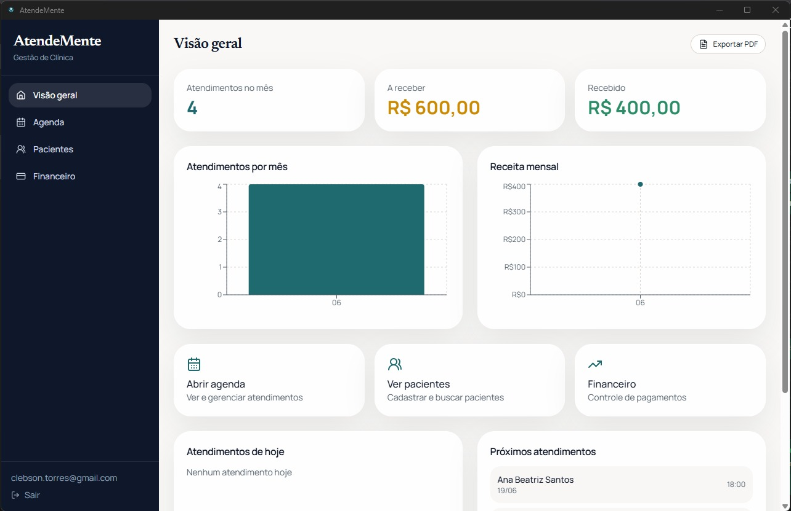
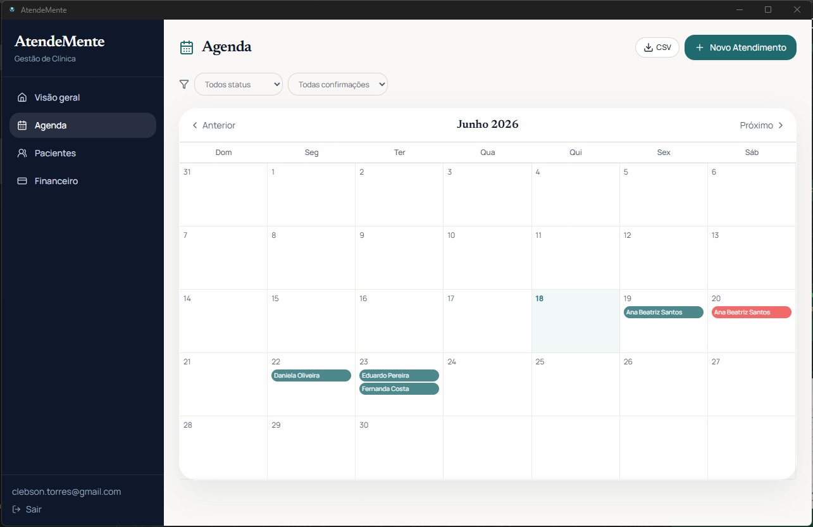
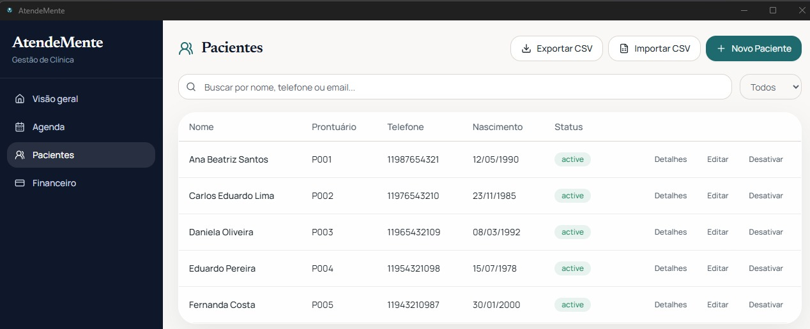
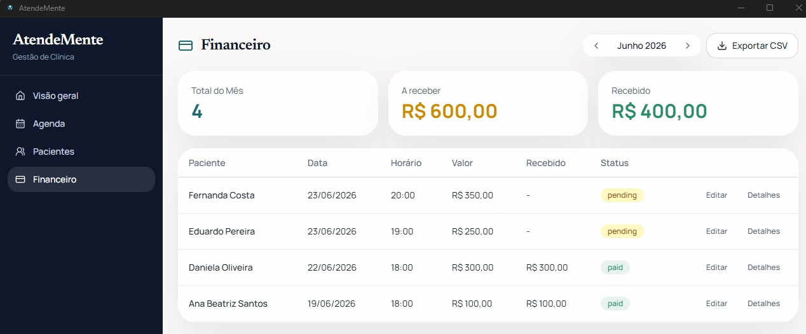

# AtendeMente

<p align="center">
  
</p>

Aplicação desktop para gestão de consultórios de psicologia. Combina shell Tauri v2,
frontend React/Vite/TypeScript com API embarcada Rust/Axum e SQLite local.

Mais detalhes sobre o projeto em [clebson-torres.github.io/atendemente.app](https://clebson-torres.github.io/atendemente.app/).

## Stack

| Camada     | Tecnologia                                              |
|------------|---------------------------------------------------------|
| Desktop    | Tauri v2                                                |
| Frontend   | React 18, TypeScript, Vite 6, Tailwind CSS 3, Zod 4    |
| Backend    | Rust, Axum, Tokio, SQLx                                 |
| Banco      | SQLite (1 por usuário)                                  |
| Hash senha | Argon2id (19 MiB, 2 iterações)                          |
| Criptografia | AES-256-GCM + HKDF-SHA256 (por usuário)              |
| Keychain   | keyring v3 (Windows Credential Manager / macOS Keychain)|
| Testes     | Vitest (unit), Playwright (E2E) — 131 frontend, 154 Rust|

## Funcionalidades

- **Autenticação local** — email + senha com Argon2id, rate limit (5 tentativas/10min)
- **Recuperação de conta** — código de 8 bytes (64 bits) em hex, formato
  `XXXX-XXXX-XXXX-XXXX`, guardado como hash SHA-256. É de **uso único**: ao redefinir
  a senha o código usado é invalidado e um substituto é emitido na tela
- **Recuperação manual** — digitar código de recuperação manualmente (fallback sem arquivo `.json`)
- **Bloqueio por inatividade** — overlay após 5 min, exige senha para desbloquear
- **Onboarding** — 3 telas (boas-vindas, secret recovery, backup) para novos registros
- **Status de segurança** — card no Dashboard com visão geral da proteção da conta
- **Pacientes (CRUD criptografado)** — telefone, email, data de nascimento, telefone de
  emergência, histórico clínico, medicações e anotações ficam num blob AES-256-GCM,
  com chave derivada por usuário via HKDF. Nome e número de prontuário permanecem em
  texto claro por necessidade funcional (busca por nome e unicidade do prontuário)
- **WhatsApp** — link direto `wa.me` no detalhe do paciente
- **Google Meet** — botão "Iniciar Atendimento" no detalhe do paciente
- **Busca indexada** — nome via `LIKE` na coluna em claro + índice `patient_search_tokens`
  para telefone/email. Atenção: esse índice guarda telefone e email **em texto claro** —
  é o que permite busca por substring, e é uma limitação conhecida
- **Detecção de duplicatas** — identidade por nome + telefone via token `identity_key`
- **Agendamento** — consultas com status, duração, observações, reagendamento
- **Recorrência** — suporte a consultas recorrentes (semanal, quinzenal, mensal, etc.)
- **Cancelar série** — opção de cancelar toda a série recorrente no detalhe do agendamento
- **Pagamentos** — registro de valores, métodos, status (pendente/pago/cancelado)
- **Dashboard** — cards com totais do mês, atendimentos de hoje, próximos atendimentos e
  gráficos de atendimentos e receita por mês (últimos 12 meses)
- **Timeline do paciente** — linha do tempo com consultas e pagamentos consolidados
- **Exportação** — dados do paciente em formato ZIP, CSV de pacientes/agenda/financeiro
- **Upload de arquivos** — anexos por consulta (armazenamento local criptografado)
- **Backup criptografado** — exportação `.atendemente` com AES-256-GCM; a senha é
  obrigatória, inclusive nos backups automáticos (um backup contém o prontuário
  completo, então nunca é gravado em texto claro). A senha dos backups automáticos
  fica no cofre de credenciais do sistema; sem ela não há como restaurar, e sem
  senha definida o backup automático não é gerado.
- **Headers de segurança** — CSP restritivo, X-Frame-Options DENY, X-Content-Type-Options nosniff
- **Auditoria** — logs de acesso e alterações sensíveis

> **Acesso mobile foi removido.** A versão anterior tinha um toggle que colocava a
> API na rede local, mas sem TLS e sem pareamento de dispositivo — senha, token de
> sessão e prontuários trafegavam em texto claro na Wi-Fi. Além disso a feature não
> funcionava de fato: num app instalado o frontend não era servido ao celular. O
> servidor agora escuta **somente em loopback** (`127.0.0.1` e `[::1]`), e a regra de
> firewall criada pela versão antiga é removida automaticamente na primeira
> execução. A reconstrução com transporte seguro está na branch
> `feat/mobile-access-seguro`.

## Screenshots

<p align="center">
  
  
</p>
<p align="center">
  
  
</p>

> A captura de Configurações foi retirada: mostrava o menu "Acesso Mobile" (removido)
> e um fluxo de backup que não existe mais. Precisa ser refeita — e sem dados reais
> de paciente na tela.

## Instalação

O setup principal é feito via **GitHub Releases**. Baixe o instalador da
[última release](https://github.com/Clebson-Torres/AtendeMente/releases) para Windows, macOS ou Linux.

### Desenvolvimento

```bash
npm install
```

Configure variáveis de ambiente (ou use os defaults):

```env
DATABASE_URL=sqlite:C:/Users/you/.config/atendemente/atendemente.db?mode=rwc
AUTH_DATABASE_URL=sqlite:C:/Users/you/.config/atendemente/auth.db?mode=rwc
SERVER_PORT=3001
STORAGE_DIR=C:/Users/you/.config/atendemente/uploads
DATA_DIR=C:/Users/you/.config/atendemente/data
MASTER_PEPPER=base64-32-bytes
```

`DATA_DIR` é onde ficam os bancos por usuário (`<DATA_DIR>/<user_id>/atendemente.db`).
Testes e scripts devem apontá-lo para uma pasta temporária junto com `DATABASE_URL`,
`AUTH_DATABASE_URL` e `STORAGE_DIR` — caso contrário gravam dados de teste no
diretório de produção.

A chave mestra (`MASTER_PEPPER`) é opcional. Se não for fornecida, o sistema gera uma
de 32 bytes via CSPRNG e a armazena no Windows Credential Manager (ou macOS Keychain).

> **`MASTER_PEPPER` é um override apenas do processo.** Ela nunca é gravada no cofre
> de credenciais. Versões anteriores persistiam esse valor, então um pepper de teste
> substituía silenciosamente o pepper real da máquina — e sem o pepper original todos
> os registros cifrados daquela máquina ficam ilegíveis. Para trocar o pepper
> armazenado, remova a entrada do cofre e deixe o app gerar um novo.

## Desenvolvimento

```bash
# Tauri desktop
npm run tauri dev

# Só frontend (API precisa rodar separada)
npm run dev

# Servidor standalone (para testar sem Tauri)
cd src-tauri && cargo run --bin server -- --port 3001
```

O frontend espera a API em `http://localhost:3001/api`.

## Testes

```bash
# Unitários + integração (Vitest)
npm run test

# Rust
cd src-tauri && cargo test

# E2E (Playwright) — local apenas
npm run test:e2e
```

## Build

```bash
# Frontend
npm run build

# Desktop (gera instalador)
npm run tauri build

# Servidor standalone
cd src-tauri && cargo build --bin server --release
```

## Estrutura do Projeto

```
screenshots/      Imagens do app (README)
src/
  components/     Componentes React (UI, Layout, LockScreen, onboarding, security)
  pages/          Telas (Login, Register, OnboardingFlow, Dashboard, Patients, Appointments, Payments)
  lib/            Helpers (auth.ts, api.ts, utils.ts, format.ts)

src-tauri/
  src/
    api/          Rotas Axum (routes.rs)
    auth/         Autenticação (mod.rs, auth_service.rs, tests.rs)
    features/     Lógica de negócio (patients, appointments, payments, records, backup, dashboard)
    db/           SQLite (init, models, migrations)
    crypto.rs     AES-256-GCM + HKDF
    config.rs     Config + keychain loading
    middleware.rs Headers de segurança
    rate_limit.rs Rate limiting por escopo
    db/migrations/       SQL migrations do banco do usuário
    db/auth_migrations/  SQL migrations do banco de autenticação
  icons/          Ícones do app

e2e/              Testes Playwright (specs, fixtures, runner)
tests/            Testes Vitest (auth, appointments, schemas, format, cn, form, modal, ...)
tsconfig.json       Type-check de src/
tsconfig.tools.json Type-check de tests/ e e2e/ (com tipos de Node)
```

## Migrations são imutáveis

O SQLx calcula SHA-384 sobre o **conteúdo cru** de cada arquivo de migration e grava
o resultado em `_sqlx_migrations`. Se um único byte mudar — incluindo um final de
linha — o app passa a recusar abrir **todo banco que já aplicou aquela migration**,
com `Migrate(VersionMismatch(<versão>))`, e não inicia.

Consequências práticas:

- **Nunca** edite uma migration já publicada. Para mudar schema, crie uma nova.
- **Nunca** normalize finais de linha desses arquivos. O `.gitattributes` marca
  `src-tauri/src/db/migrations/*.sql` e `src-tauri/src/db/auth_migrations/*.sql` como
  `-text`, impedindo que o `core.autocrlf` do Git para Windows os reescreva no
  checkout. Se criar um diretório novo de migrations, adicione-o lá também.
- Ao numerar uma migration nova, confira se o número não foi usado em outra branch.
  Versões iguais com checksums diferentes travam o app na inicialização.

## CI

O workflow do GitHub Actions executa:

1. **quality** (ubuntu-latest)
   - TypeScript check de `src/`, `tests/` e `e2e/`
   - Testes unitários + integração (Vitest)
   - Build do frontend

2. **build** (ubuntu, windows, macos — após quality; roda também em tags)
   - `cargo test --lib` — os testes Rust nos três sistemas
   - Compilação do backend Rust e build do frontend
   - **Smoke test**: sobe o binário `server` com bancos isolados e verifica que
     `/api/health` responde e que `register`/`login` funcionam. Isso cobre a falha
     mais comum em produção — a janela abrir e o servidor não carregar — que um
     simples "o arquivo existe" não detecta

3. **release-build** + **release** (somente em tags `v*`, após quality **e** build)
   - `npm run tauri build` nos três sistemas e publicação dos instaladores
     (`.msi`, `.deb`, `.AppImage`, `.dmg`) numa GitHub Release

Não cobertos pelo CI hoje: a suíte E2E (Playwright) e `cargo clippy` — este último
tem 29 avisos pré-existentes, então habilitá-lo como bloqueante exige limpá-los antes.

## Licença

Proprietária — todos os direitos reservados.
